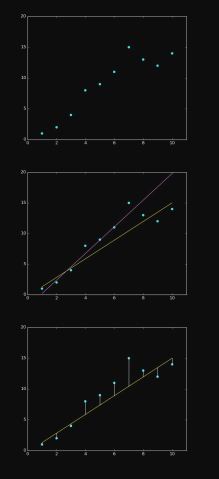

# ML recap

Suppose that we have a set of I/O pairs (training set)
$({<x_i, y_i>})$
the problem consists in guessing a map $x_i \rightarrow y_i$
In M.L.,

- we decsribe the problem with a _model_ depending on some _parameters_ $\Theta$.
- define a loss function to compare the results of hte model with the expected (experimental) values
- _optimize_ (fit) the parameters $\Theta$ to reduce the loss to a _minimum_.

#### Example: a regression problem

In a regression problem, we have a set of points, and we need to fit a line into these points.

- Step 1
  - Fix a parametric class of models. For intance linear functions $y = ax + b$; $a$ and $b$ are the parameters of the model
- Step 2
  - Fix a way to decide when a line is better than another (loss function). For instance, using mean square error (mse).
- Step 3 - Try to tune the parameters in order to reduce the loss (training).
  

## Why Learning?

Machine Learning problems are in fact optimization problems!
So, why are we talking abt learning?
The point is that the solution to the optimization problem is _not given in an analytical form_, meaning that we do not have a solving equation (often there is no closed form solution).
So, we use _iterative techniques_ (typically, _gradient descent_) to _progressively approximate the result_.
This form of iteration over data can be understood as a way of _progressive learning_ of the objective function based on the experience of past observations.

## Gradient descent (again)

- backpropagation is applied

# Taxonomy

## Different types of Learning Tasks

- _supervised learning_: inputs + outputs (labels)
  - classification
  - regression
    
- _unsupervised learning_: just inputs
  - clustering
  - component analysis
  - anomaly detection
  - autoencoding
    
- _reinforcement learning_: actions and rewards - learning long-term gains - planning - Sometimes, you have local rewards - The purpose is not to optimize the local reward, but the future locative reward, since we are not just interested only in the current situation, but rather in all the future evolutions of the agents.
  

### Classification vs. Regression

### Many different techniques

\[..\]

## Neural Networks

It's a network of artificial neuron:

Each neuron takes multiple inputs and produces a single output (that can be passed as input to many other neurons).

We have an input layer, an output layer, an a set of hidden layers.

If a network has only one hidden layer, it is called a shallow networks, but if we have more than one layer, it is called deep NN.

### Artificial neuron

We have a linear combination of the inputs, which is in turn given to an **activation function** (i.e. a sigmoid).
**Each neuron** implements a _logistic regressor_: $$\sigma(wx +b)$$Machine learning tells us that the logistic regression is a valid technique.

The expressiveness of the networks derives entirely by the linearity of the \[...\].

We use a linear combination since we want to keep each node simple: computing the linear combination is simple.

#### Different activation functions

Each _activation function_ is responsible for _threshold triggering_.

Activation functions introduce non-linearity (?)
The sigmoid function is a kind of approximation of a threshold, binary function.

### The real, cortical neuron

The neuron has a dendritic tree, which ends in the sinapses. Each dendritic tree is a set of weighted inputs, which are combined. When a triggering threshold is exceeded, the Axon Hillock generates an impulse that gets transmitted through the axon to other neurons.

- Otherwise, if the sum is below a certain threshold, then it is blocked.

### Comparisons

- ANN vs real neuron
  

- The human brain has a number
- The human brain is not so fast since it is not an electrical transmission, but rather a chemical reaction. The switching time is 0.001 s.
- How many synapses? It is 10^4, since many neuron are connected to a lot of neurons.

# Network topologies

- If the network is _acyclic_, it is called a **feed-forward network**.
  - 90% of NN are feed-forward.
- If it _has cycles_ it is called **recurrent networks**.
  - RNN are used for processing sequences of any kind, but also these networks are being replaced by feed-forward equivalents.

## Types of layers

### Dense layer

A dense layer, _each neuron_ is _connected_ to _all the neurons_ of the _next layer_.
Let's define the computational complexity of the dense layer:

- A single neuron is
  $$
  I^n \cdot W^{n} + B^1 = O^1
  $$
- But the operation can be vectorized (and, consequently, parallelized) to produce $m$ outputs in parallel:
  $$
  I^n \cdot W^{n \times m} + B^m = O^m
  $$
  I dense layers usually work on flat (unstructured) inputs I the order of elements in input is irrelevant

In dense layers, we can do a permutation on the position of a neuron and it is irrelevant.

- dense layers usually work on flat (unstructured) inputs
- the order of elements in input is irrelevant
  - We can do permutations on the vertical position
  - this is because each neuron is connected to all neurons.

### Convolutional layer

\[..\]
Each neuron at layer $k − 1$ is connected via a parametric kernel to a fixed subset of neurons at layer $k$. The kernel is convolved over the whole previous layer.

- The output is not produced by all the neuron of the layer, but only on a few neurons
  We have a kernel of weights of dimension

The kernel is shifted (moved to the next position, slided to the next position of the input to the output).

- This operation is called **convolution**.

## Parameters and hyper-parameters
