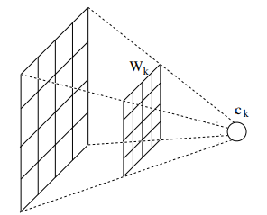
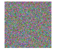
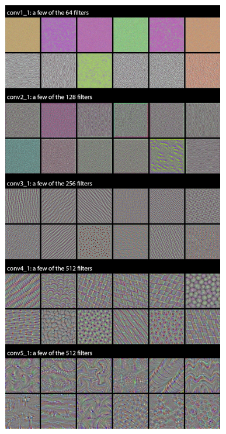
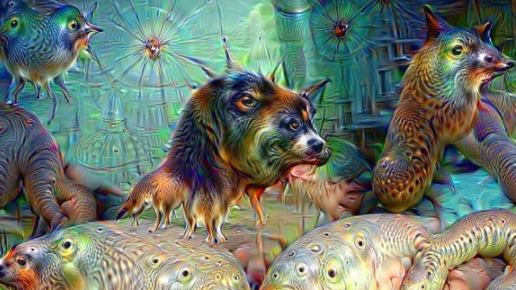
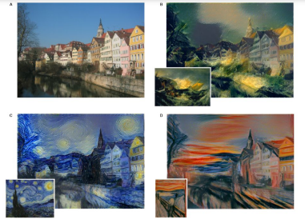
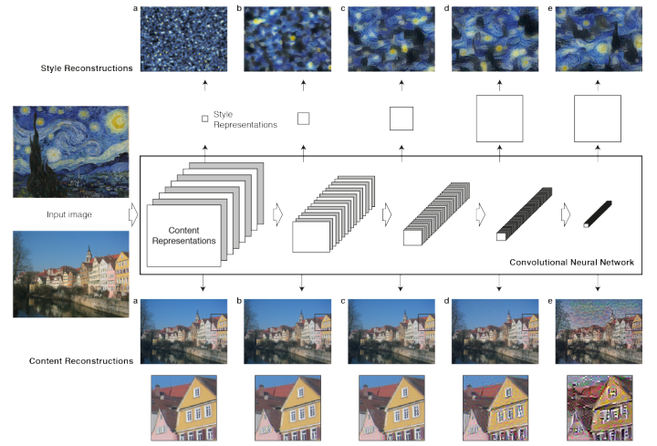
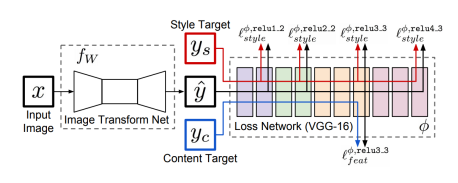
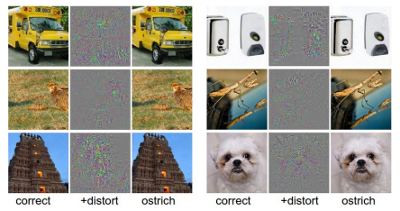

Each neuron in a neural network gets activated by specific patterns in the input image, defined by the weights in it receptive field.

The intuition is that neurons at higher layers should recognize increasingly complex patterns, obtained as a combination of previous patterns, over a larger receptive field. 

In the highest layers, neurons may start _recognizing patterns_ similar to _features of objects_ in the dataset, such as feathers, eyes, etc. In the final layers, neurons gets activated by “patterns” identifying objects in the category. 

##### Can we confirm such a claim?

## Visualization of hidden layers
Our goal: find a way to _visualize the kind of patterns a specific neuron gets activated by_.

The loss function $L(θ, x)$ of a NN depends on the _parameters_ $θ$ and the _input_ $x$. 
During training, we fix $x$ and compute the partial derivative of $L(θ, x)$ w.r.t the parameters $θ$ to adjust them in order to decrease the loss.
In the same way, _we can fix_ $θ$ and use partial derivatives w.r.t. input pixels in order to syntehsize images _minimizing the loss_. 
In this way, we can compute an activation of some neuron, and understand how I should modify my input to increase or decrease the activation of a neuron. Thus, we could find, for example, which kind of _input maximizes this kind of activation. 

## The gradient ascent technique
Start with a random image, e.g.

- do _a forward pass_ using this image $x$ as input to the network to _compute the activation_ $a_i(x)$ caused by $x$ at some neuron (or at a whole layer) 
- do _a backward pass_ to compute the gradient of $\dfrac{∂ai(x)}{∂x}$ of $a_i(x)$ with respect to each pixel of the input image (this is the actual gradient ascent step). 
- _modify the image_ adding a small percentage of the gradient $\dfrac{∂ai(x)}{∂x}$ and repeat the process until we get _a sufficiently high activation of the neuron_.

> [!WARNING]
> There's no real difference between the gradient ascent and gradient descent process, since we can convert a minimization problem into a maximization problem by just negating the objective function.
> It's called gradient ascent only because we are trying to _increase_ a value (which is the value of the activation of the neuron). 

#### Example of visualization

## A different approach
A different approach would be in using an input image and trying to understand which parts of the image are actually recognized by the network. 
To do that, we take the image, we take a particular internal layer, and what we do is trying to minize the loss between the original image and the internal representation of the image that we are interested in. In this way, we are basically _synthesizing an image_ _that is not distinguishable_ from the original image in that specific layer of the network (meaning, they would produce the same activation). 

Essentially, we are trying to understand the inner representation at some layer by generating an image indistinguishable from the original one.

### The technique
- Goal: given an input image $x_0$ with an internal representation $Θ_0 = Θ(x_0)$, generate a different image $x$ such that $Θ(x) = Θ_0$, 
- Approach: via gradient ascent starting form a noise image. _Instead_ of optimizing towards a given category or the _activation_ of a neuron, _minimize the distance_ from $Θ_0$:

Obviously, it is much simpler to minimize this function when we are at a layer that is close to the start of the network, since this is when the result is much more similar to the starting image.
- The more we traverse the network, the more the input becomes deconstructed and so it is more difficult to reconstruct. 

#### Results

As we can see, the input becomes progressively fuzzier, and it seems that our network almost deconstructs the whole image. 

#### Inceptionism

you've seen this shit for sure in some creepy youtube video. 
Essentially, it is image manipulation that injects inside the image the notions that we have just said, by applying the gradient descent techniques to particular layers of the network. 
\[this is what asperti said, I know it is not quite clear but in the next paragraph it will be explained better\]

###### Deep dreams
Initially intended to visualize what a deep neural network is seeing when it is looking in a given image (so it is the gradient descent techniques), it is now used as a procedural art form for making new form of psychedelic and abstract art. 

##### The approach
- _train a network_ for image classification 
- _revert the network_ to _slightly adjust_ (via backpropagation) _the original image_ to improve _activation of a specific neuron_. 
- after enough reiterations, even imagery _initially devoid of the sought features will be incepted by them_, creating psychedelic and surreal effects; 
- the generated images take advantage by strong regularizers privileging inputs that have statistics similar to natural images, like e.g. correlations between neighboring pixels (texture).

##### Enhancing content
Instead of prescribing which feature we want to amplify, we can also fix a layer and enhance whatever it detected.
Each layer of the network deals with features at a different level of abstraction. 
Lower layers will produce strokes or simple ornament-like patterns, because those layers are sensitive to basic features such as edges and their orientations.

## Style transfer
The gradient ascent technique can also be adapted to superimpose a _specific style_ to a given content:

To capture the style of another image, we can use techniquies that come from the standard image processing field. In particular, we add a _feature space_ on top of the original CNN representations which _computes correlations_ between _the different features maps_ (channels) at each given layer. A technique already used to compute image textures.

#### Gram Matrix
We know that at layer $l$:
- an image is encoded with $D^l$  distinct _feature maps_ $F^l_d$
	- each of _size_ $M^l$ (width times height).
- $F^l_{d,x}$ is the _activation of the filter_ $d$ at position $x$ at layer $l$.

_Feature correlations_ for the given image are given by the __Gram matrix__ $G^l \in R^{D^l \times D^l}$ where $G^l_{d_1, d_2}$ is the dot product between the feature maps $F^l_{d_1}$ and $F^l_{d_2}$ at layer $l$:
$$
G^l_{d_1, d_2} = F^l_{d_1} \cdot F^l_{d_2} = \sum_k   F^l_{d_{1,k}} \cdot F^l_{d_{2,k}}
$$
The Gram matrix represents the internal representation of the image from the POV of style. 

#### Combine style and content
Content and style are separable, and in fact are two different inputs of the model. 

Different combinations varying the reconstrution layer (rows) and the relevance ratio between style and content (columns) -> meaning, we can privilege either _style_ or _content_ (of the original image).

#### Variants and improvements (original work of this topic)
The original work did not use the gradient descent technique, instead it use something like this:

We can see that the loss function is represented as a network (in particula the _pre-trained_ network VGG-16).

The input image $x$ could be some _random noise_, that is fed inside an _image transformation network_, which in turn is trained to transform input images into output images. 
The image transform network is the only part of this model that involves some training. 

## Recap: possible applications of gradient ascent
- if __the loss corresponds to the activation of a specific neuron__ (or a specific layer) we may _try generate images that cause a strong activation of it_, hence explaining the role of the neuron inside the network (what neurons see of the world) 
- if __the loss is the distance__, in the latent space, from _the internal representation of a given image_, we may _try to generate other images with the same internal representation_ (hence explaining what features have been captured in the internal representation) 
- if __the loss is the similarity to a given texture__, we may try to _inject stylistic information_ in the input image 
- what _if the loss is the distance from a target category in a classification network_? Can we hope to automatically synthesize images belonging to that category? (or at least having distintictive features of that category?)

### How to fool a NN
Since we have many pixels, a tiny (imperceptible to humans!), consistent perturbation of all of them is able to fool the classifier.

## Adversarial attacks and NNs as black boxes
The previous technique, being based on gradient ascent, _requires the knowledge of the neural_ net in order to fool it.
We can do something similar using the network as a black box, for instance by means of _evolutionary techniques_.
These evolutionary techniques create images optimized so that they generate high-confidence DNN predictions for each class in the dataset. 
The evolutionary approach is this:
- start with a random population of images 
- alternately apply selection (keep best) and mutation (random perturbation/crossover)

As we can see in the image, they were able to produce not only “noisy” adversarial images, but also geometrical examples with high regularities (meaningful for humans).
- In the _indirect enconding_, rather than modifying pixels of an image directly, we simply create images in a parametric way, using geometrical shapes. The algorithm then acts on the parameters of the shapes. The result is are more complex images that is not just simple noise. 
- Indirect encoding is much slower. 

