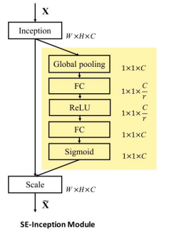
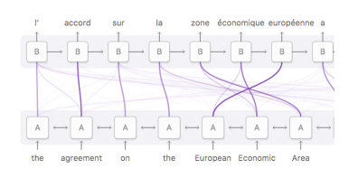
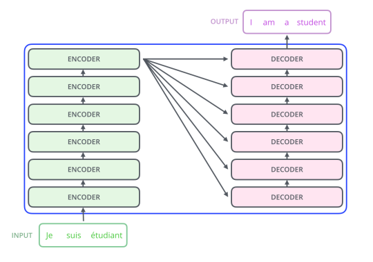
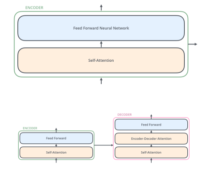
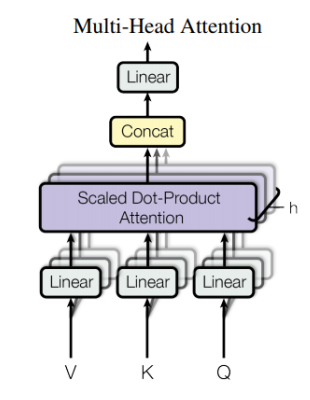
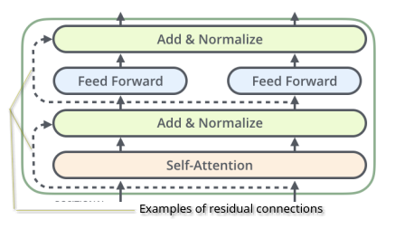
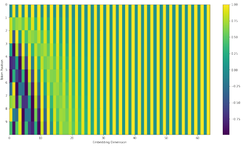

## Attention

**Attention** is the ability to _focus on different parts of the input_, according to the requirements of the problem being solved. It is an essential component of any intelligent behaviour, with potential application to a wide range of domains.

Usually, attention constist of either cropping or _masking_ all the parts that are not important. _Masking especially is what is used_, rather than cropping.

### A differential mechanism

From the point of view of Neural Networks, we would expect the attention mechanism to be _differentiable_, so that we can learn where to focus by _standard backpropagation techniques_. The current approach (not necessarily the best one) is to focus everywhere, just _to different extents_.

### Attention as gating maps

Attention mechanisms can be implemented as _gating functions_. The gating maps are _dynamically generated by some neural net_, allowing to focus on different part on the input at different times.
==The forget map, input map and output map in [[2023-05-02 - Recurrent Neural Networks#Long-Short Term Memory (LSTM)|LSTMs) are examples of attention mechanisms==.

### Another example: squeeze and excitation

**SE layers** are a building component of **Squeeze and Excitation Networks**.
_SE layers_ implement a form of self attention, allowing to _focus on particular channels in a **dinamical** way_, according to the input under consideration.

The SE-inception module essentially does this: it reduces the number of channels, and then generates a boolean map for each one of the regional channels. This allows only to focus on the maps that we care about.

## Key-value attention

The most typical attention layer is based on the key-value paradigm, implementing a sort of **associative memory** (i.e. a dictionary).
We access this memory with queries to be matched with keys. The resulting _scores_ generate _a boolean map that is used to weight values_.

In this approach, we have _key-value_ pairs and a query. We need to find which key is matches the query.
Since we want to compare 2 vectors, some typicals metrics that we can use are _cross-similarity_.
So this is the general process:

- For each key $k_i$ compute the _scores_ $a_i$ as:
  $$
  a_i = \alpha(1,k_i)
  $$
  (the $\alpha$ is the score function.)
- then, obtain _attention weights_ via _softmax_:
  $$
  \vec b = softmax(\vec a)
  $$
- return a _weighted sum_ of the values:
  $$
  o = \sum^n_{i=1} b_iv_i
  $$
  In many applications, _values_ are also used _as keys_ (**self-attention**).
  

From Tensorflow official explanation:
An attention layer does a fuzzy lookup like this, but it's not just looking for the best key. _It combines_ the `values` based *on how well the* `query` matches each `key`.

How does that work? In an attention layer the `query`, `key`, and `value` are each vectors. Instead of doing a hash lookup the attention layer combines the `query` and `key` vectors to determine how well they match, the "**attention score**". The layer returns *the average across all the* `values`, _weighted_ by the "attention scores".

Each location the query-sequence provides a `query` vector. The context sequence acts as the dictionary. At each location in the context sequence provides a `key` and `value` vector. The input vectors are not used directly, the [`layers.MultiHeadAttention`](https://www.tensorflow.org/addons/api_docs/python/tfa/layers/MultiHeadAttention) layer includes [`layers.Dense`](https://www.tensorflow.org/api_docs/python/tf/keras/layers/Dense) layers to project the input vectors before using the

#### Score function

Different score functions lead to different attention layers. Two commonly used approaches are:

- **Dot product**:
  $$
  \alpha(q,k) = q \cdot k \sqrt{d}
  $$
  The query and the key must have the _same dimension_ $d$.
- **MLP**: $α$ is computed by a _neural network_ (usually composed by a single layer):
  $$
  α(k, q) = tanh(W_k \vec k + W_q\vec q)
  $$

## Attention applied to translations

First, here's some terms that you need to know:

- **alignment**: identify which parts of the _input sequence_ are **\_relevant** to each word in the output\_.
- translation: y'all already know; is the process of using the relevant information to select the appropriate output.

Alignement is a form of attention!

Here's how alignment works:

## Transformers

Transformers have been introduced in [Attention is All You Need](https://arxiv.org/abs/1706.03762), one of the most influential works of recent years. This works stated that the LSTM where not needed anymore to process text, but rather, it was possible to achieve even better result by simply using attention and feed-forward networks.
**Transformers** have rapidly become the _model of choice for NLP_. Applications like Bert and GPT (General Pre-trained Trainsformer), (with all relative families) are based on Transformers.

### General structure of transformers

#### Encoder & decoder

A transformer has a traditional _encoder-decoder structure_, with connections between them.
The **encoding component** is a stack of _encoders_. Similarly, the **decoding component** is a stack of _decoders_.

- The encoder is supposed to extract information about the input (i.e. semantics), and is used to condition the generation of the output made by the decoder (typically, is just the last encoder of the stack that condition all the elements of the decoder).
  

#### Structure of encoder and decoder modules

- The **encoder** is organized as a **\_self-attention** layer* (query, key and value are shared), followed by \_feedfoward component* (a couple of dense layers).
  - Each output is obtain as a weighted combination of the input.
- The **decoder** is _similar_, with _an additional attention layer_ that helps the decoder to _focus on relevant parts_ of the input sentence (meaning, according to the information passed on by the decoder).
  

#### Multi-head attention

Using _multiple heads_ for _attention_ expands the model’s ability to focus on _different positions_, for different purposes. As a result, multiple “representation subspaces” are created, focusing on potentially different aspects of the input sequence.

- This focus on different positions happens in parallel.
  

#### Masking the future

The process of masking in transformers is used in the _decoder part_.
Essentially, we can apply a boolean mask to the input, to hide part of its content. This is frequently used in the decoder to prevent it to attend at future positions during generation.

- In general, it prevents confusion inside the NN (i.e. some tokens are only the initial part of a phrase that is not relevant to the generation of text etc...)

#### Residual connections

Each sub-layer (self-attention, ffnn) in each encoder has a residual connection around it, and it is followed by a layernormalization step.

Why? who knows. Not me for sure, since neither asperti nor the slides mention it.

#### Positional encoding

**Positional encoding** is added to word embeddings to give the model some information about the _relative position_ of the _words in the sentence_.
The positional information is a vector of the same dimensions $d_{model}$, of the word embedding. The authors use _sine_ and _cosine_ functions of different frequencies.

- It provides some structural information in relation to a relative position of phrase in a certain language (i.e. i should always be more focused to 2 tokens on the right of the current token etc...)

Each important position is then encoded as a _sequence of frequencies_, that form some barcode like structure.  

This type of representation is also used since it can be expressed as a linear mapping, which is easily learn by a linear perceptron.
